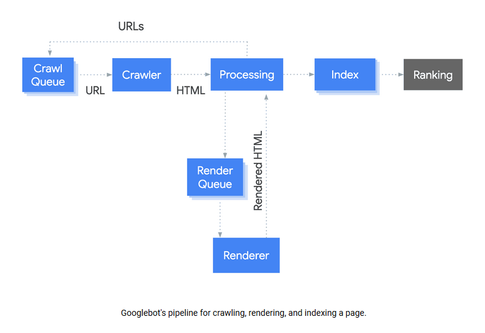

# 3. Rendering

Key Items we Know about Google's Web Rendering Service \(WRS\).

* It uses a near-up-to-date version of Google Chrome.
* Google doesn't use cookies \(they do seem to persist cookies across 30X requests\).
* Service workers are not allowed by Googlebot.
* Google overrides random number functions to ensure a predictable state.
* The Live Test \(Fetch and Render\) in Google Search Console, is different from Googlebot.  Live Test is time sensitive, Googelbot is not.
* Googlebot will try to wait until there are no longer network activity by the headless browser.
* The date and time of crawling and indexing may differ.  Google may index what they have if the crawl and render fails.
* Googlebot does not need to paint pixels as the service runs Chromium headless, so it omits that step of the render process.

Source: [Martin Splitt's talk at TechSEO Boost, 2019](https://www.catalystdigital.com/techseoboost-livestream-2019/). 

## Recent Articles on JavaScript Rendering

Google's Martin Splitt has spent a tremendous amount of time over the last year educating developers and SEOs on the limitations of Google's ability to render JavaScript websites. He is represented in many of the articles below as the authoritative source.

### Understand the JavaScript SEO basics

JavaScript is an important part of the web platform because it provides many features that turn the web into a powerful application platform. Making your JavaScript-powered web applications discoverable via Google Search can help you find new users and re-engage existing users as they search for the content your web app provides.

**Link**: [https://developers.google.com/search/docs/guides/javascript-seo-basics](https://developers.google.com/search/docs/guides/javascript-seo-basics)

### Fix Search-related JavaScript problems

This guide helps you identify and fix JavaScript issues that may be blocking your page, or specific content on JavaScript powered pages, from showing up in Google Search. While Googlebot does run JavaScript, there are some differences and limitations that you need to account for when designing your pages and applications to accommodate how crawlers access and render your content.

**Link**: [https://developers.google.com/search/docs/guides/fix-search-javascript](https://developers.google.com/search/docs/guides/fix-search-javascript)

### Making JavaScript and Google Search work together

We introduced a new Googlebot at Google I/O and took the opportunity to discuss improvements and best practices for making JavaScript web apps work well with Google Search

**Link**: [https://web.dev/javascript-and-google-search-io-2019/](https://web.dev/javascript-and-google-search-io-2019/)

**By**: 
[Martin Splitt](https://twitter.com/g33konaut) and [Lizzi Harvey](https://twitter.com/HarveyLizzi)

### Making JavaScript Work for Search with Martin Splitt & Ashley Berman Hale

Read our recap of the Q&A webinar we hosted with Google's Martin Splitt on how to make JavaScript-powered websites discoverable and indexable in search.

**Link**: [https://www.deepcrawl.com/blog/webinars/making-javascript-work-for-search-martin-splitt/](https://www.deepcrawl.com/blog/webinars/making-javascript-work-for-search-martin-splitt/)

**By**: [Rachel Costello](https://twitter.com/rachellcostello)

